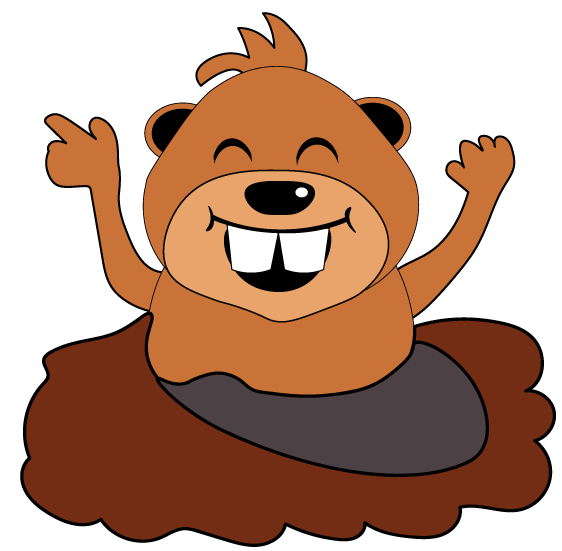

# Whac a Mole  

 

### Introduction 

Whac a Mole is my second project ( Portfolio 2). It is a one page website focused on the game that gives the page name, Whac a Mole, developed using HTML, CSS and Javascript vanilla. My objetive with this project was to improve my javascript and at the same time create a fun game, bringing back memories from carnivals games, and providing a distraction during a boring day, playing a quick and simple game online, directly on the browser without the need to install or download any software. 

  

[Live Webpage!](https://danielterceiro.github.io/whac/):earth_americas: 

  

## UX 

My primary goal was to ensure that the users, new or returning, would be able to play the game without the need to install anything, or even moving from the main page, simple clicking start and enjoy. That’s why the website is made of only one page, with the game at the top, following by the “How To Play” for new users and a brief history of the creation of the game Whac a Mole, for the curious users. 

A minimalist design was employed focusing on the gaming experience, click and go. 

A quick menu on the nav bar on the right top corner help the user navigate from the Game, How to Play and History. 

The main color used were: 

Green and Blue for the field 

Brown for the sand to hide the mole 

 Red and orange for the logo of the game 

Light Cyan for the background 

Dark green for the titles on the page, nav bar and footer 

 

 

### Target Audience 

* Users looking for a quick game. 

* Users already experienced in gaming . 

* Users interested in pasing time quickly. 

  

### First Time Users 

* As a user, I'm looking to find out about how to play the game. 

* As a first time visitor I need to be able to understand, navigate and find what i'm looking easily. 

* As a user  I want to be able to play the game fast. 

* As a first time user I want to learn more about the game 

  

### Returning Users 

* As a returning user I want to be able to jump straight to the game. 

* As a returning user I want to know my highest score. 

* As a returning user I want to be able to contact the developers if necessary trought social media. 

  

### Frequent Users 

* Frequent users would have the same needs as a returning user. 

  

## Wireframes 

I designed the wireframes on Balsamiq, below I linked the folder with my wireframes, I kept it simple, as a low fidelity wireframes to be used as a guide for the design of the website, but in general I kept the same format as it was straight forward what I had in mind for a one page websire focusing on the game to be played.  

[Wireframes Project 2](https://github.com/DanielTerceiro/Yoga-Natural/tree/main/assets/doc-readme/wireframes) 

  

## UI 

### Color Scheme 

I wanted a color scheme simple and focusing on the game instead of the page background or any other distraction. 

* green(#3e8428) for nav bar selected, sub-titles and footer 

* black (#000000) for paragrah text  

* off-white (#fafafa) for itens over other colors and background 

*Light Cyan (#d5fcfc) for the background 

 

  

 

  

All colors were selected from [Coolors](https://coolors.co/) 

  

### Typography 

  

Following the same principle on the color schema, I wanted to keep it simple, efficient and able to run on any type of browser old or new, so using google fonts was the best option and font that are common use: 

  

* **Montserrat** - was my choice of use for the versatilite to be able to be used as header and for being open source. 

*** Helvetica** - was also choose to be used on the paragraphs text.  

  

## Features 

* The page is fully responsive across desktop, tablets and mobiles. 

 

  

### Visual 

* **Desktop**  

The homepage is the only page for the website, consisting on the Header, following by the game Whac A Mole, below the How to Play, after the History about the game and by last the footer. 

Keeping it simple and with the main objetive to provide a quick game for the user. 

 

  

### Features to implement in the future 

* In the future the first plan is to add more dificults level, as at the moment only one is available. 

* I would like to add as well variants of the mole, one to give negative points or others functions. 

* An option to play against the machine as One vs One. 

 

## Technologies Used 

Below is everything that I used throughout development for the building of the website: 

  

* [HTML](https://en.wikipedia.org/wiki/HTML5) - HTMl5 provided the content and the structure of my website. 

* [CSS](https://en.wikipedia.org/wiki/CSS) - To provide style to all pages. 

*[JavaScript](https://www.w3schools.com/js/js_intro.asp) - To provide content to help me with JavaScript 

* [Google Fonts](https://fonts.google.com/)- Google fonts was used for the Font used. 

* [Balsamiq](https://balsamiq.com/) - For the creation of my wireframes 

* [Coolors](https://coolors.co/) - For color pallete used on the website 

* [Gitpod](https://gitpod.io/workspaces) - All code was created through Gitpod and the workspace for this project resides there. 

* [Github](https://github.com/) - For externally hold the repository and deploy the website.  

* [W3C Markup Validation Service](https://validator.w3.org/) - Used to check my HTML code 

* [CSS Validation Service](https://jigsaw.w3.org/css-validator/) - Used to check my CSS code 

  

 

## Testing 

I ran all my code through the [W3C Markup Validation Service](https://validator.w3.org/), [CSS Validation Service](https://jigsaw.w3.org/css-validator/) and [JSHint](https://jshint.com/) 

JSHint and HTML validator pointed out a couple errors and CSS was good  

* Div as a child of H2 

* mising semi colon on some lines of JS 

* Missing closing tag on sections 

* Unused Const on JS that was removed   

  

Link for the result of the test with the errors fixed:  

[CSS](https://github.com/DanielTerceiro/whac/blob/main/assets/doc-readme/css-validator/css%20validator.png)  

[HTML] https://github.com/DanielTerceiro/whac/blob/main/assets/doc-readme/html-validator/html.png)  

[JavaScript](https://github.com/DanielTerceiro/Yoga-Natural/blob/main/assets/doc-readme/html-validator/classes.jpg)  

  

### GTMetrix 

  

This website has been tested through the GTMetrix site, GTmetrix. Below is a screenshot of the results achieved. Page performance was 100% , structure 99% and the time to fully load the site was 0.58s. 

  

 

  

### Lighthouse 

  

Tested on desktop 

  

**Desktop** 

 

  

## Bugs 

During the process of creating the website I enconter some bugs and issues: 

  

* The hammer wouldn’t load for nothing on the world, and when it did the click wouldn’t go trough. 

The solution: I decided to simplify and change the cursor icon for a hammer icon, activating with JS on the click the hammer rotation. 

  

* Responsiviness of the game window was hard due the fact of having loose images inside the game frame 

The solution: clever positioning to be able to reduce to mobile size without disrupting the game, aligning the Divs of the mole and sands on the correct size to manting the proportion and the game flow  

 

## Deployment 

  

I deployed the page on GitHub pages via the following procedure: 

* Go to https://github.com and login 

* Navigate to the required repository: Yoga-Natural 

* Go to settings  

* Go down to "GitHub Pages" 

* Select the source (I chose master branch ) 

* After a brief time, a message will apper as "Your site is published at..." 

  

## Credits 

  

### Gereral Reference 

* For general advice and techniques to solve daily issues [W3 Schools](https://w3schools.com) 

  

* CI Slack Community for helping with day-to-day questions  

  

* All Medias (paid comercial license) extracted from [CreativaFabrica](https://www.creativefabrica.com/) 

* Fonts from [Google Fonts](https://fonts.google.com/) 

*[Franks Laboratory](https://www.youtube.com/c/Frankslaboratory) - Youtube channel that was used as base for the development of the game and provided the image for the sand. 

*[Kodaktif Video](https://www.youtube.com/c/KODAKTIFVIDEOEGITIM) - Another Youtube Channel that was used to help develop the game, inspiration for the Highscore count and the hammer. 

 

*[Spdy4](https://www.deviantart.com/spdy4) - For providing the logo for the game, free to use. 

 

 
